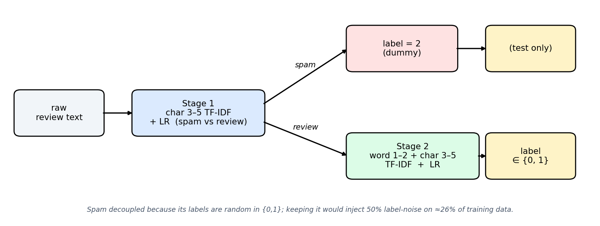
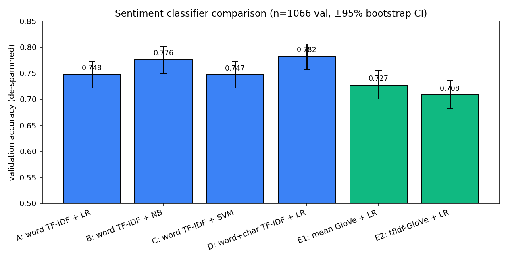
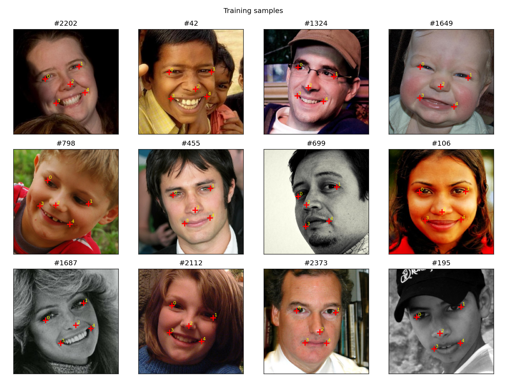
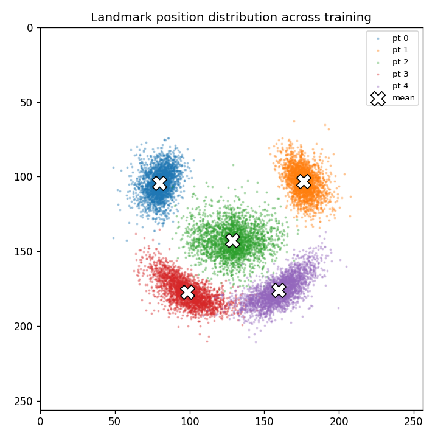
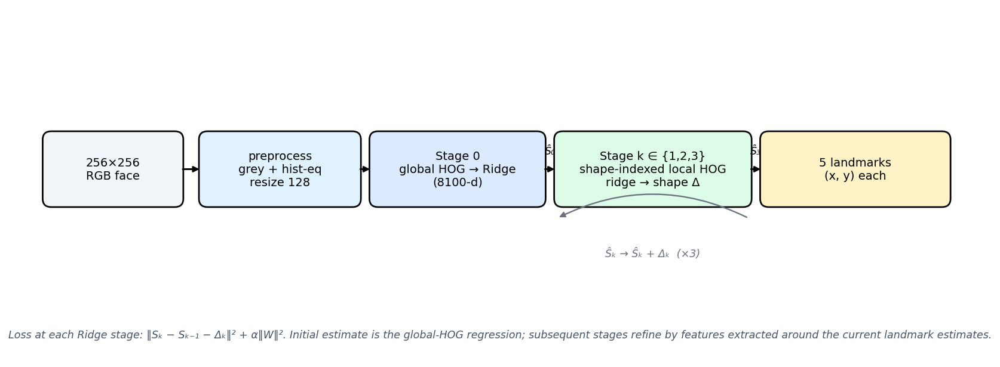
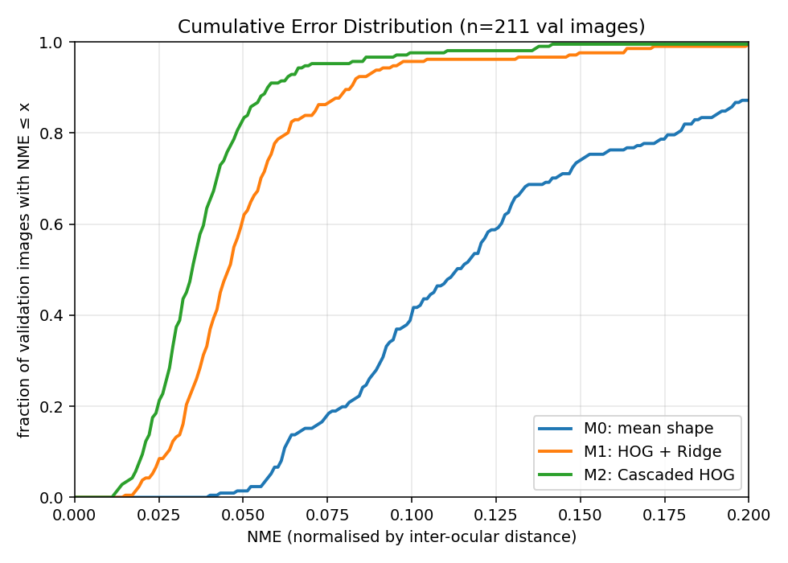
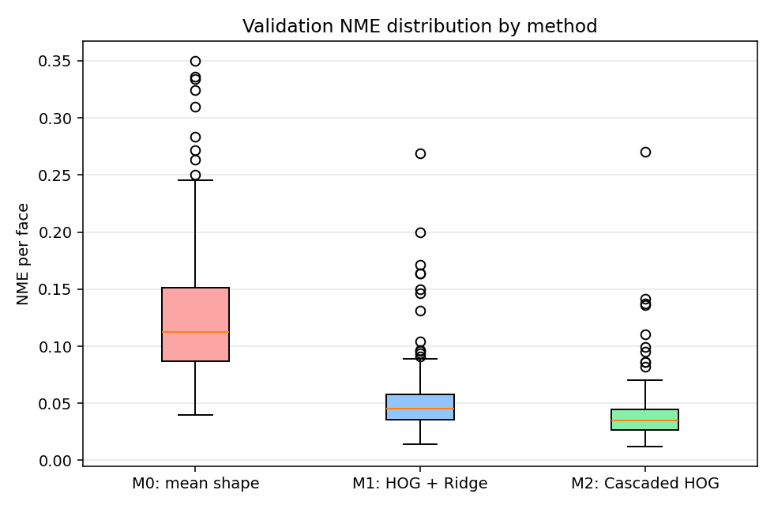
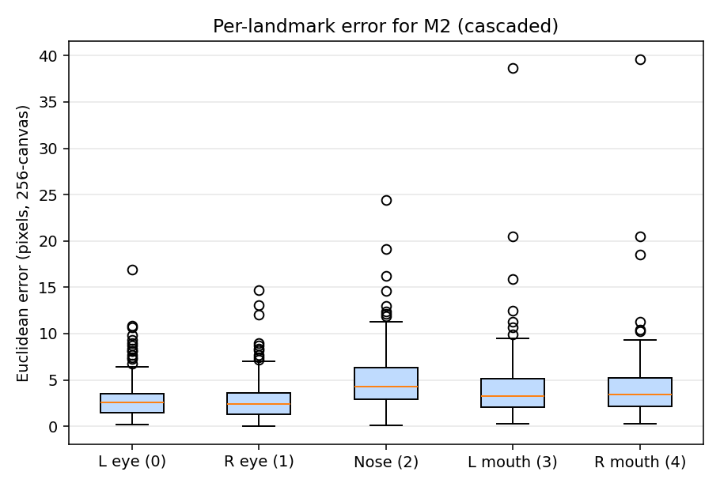
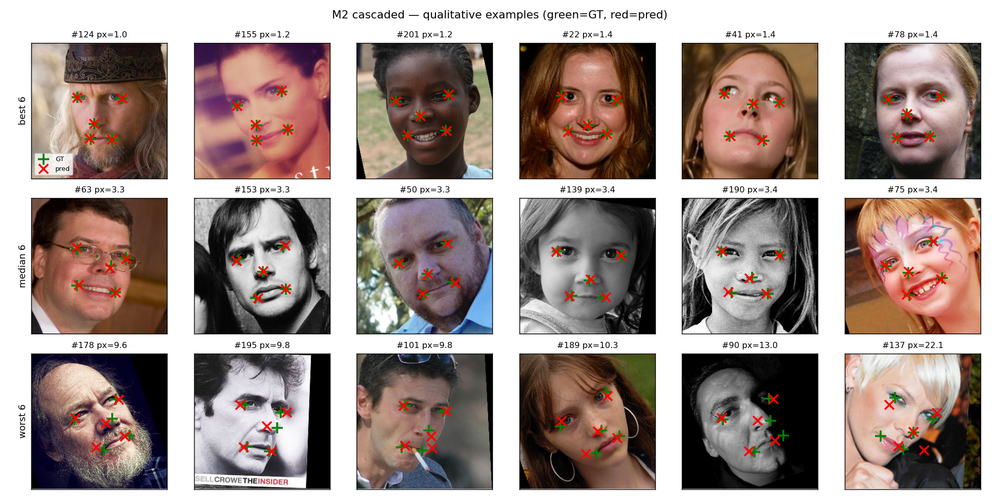
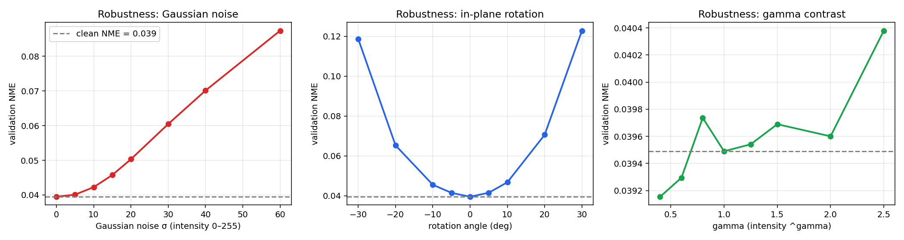

# Applied Machine Learning — Assignment Report

Code (Task 1, Task 2 and the progress journal) lives in the project
folder structure described in `PROGRESS.md`. All experiments are
reproducible from the numbered scripts under `task{1,2}/src/`.

---

## Task 1 — Sentiment analysis with spam contamination

### 1.1 Problem framing and overall design

The training data deliberately mixes two corpora: short movie-review
snippets labelled positive (1) or negative (0), and Enron-style
business emails labelled randomly 0/1. **About 26 % of training is
spam** with the random label essentially uniformly split between the
two classes (25.6 % vs 26.0 %); validation has 24 % spam, test 26 %.

Two responses are possible: (a) train one classifier on the noisy
labels and rely on regularisation, or (b) detect spam first and only
classify sentiment on the remainder. I chose (b). The random labelling
on spam is ~50 % label noise on ≈26 % of the data — well above the
10–15 % range linear models tolerate gracefully [Frenay & Verleysen
2014]. It is also the only architecture compatible with the brief's
requirement that spam in the test set receive a *dummy* label. Figure 1
shows the pipeline.

*Figure 1 — Two-stage system. Stage 1 routes the input either to the
dummy label or to Stage 2. Decoupling avoids injecting ~50% label
noise into Stage 2's training distribution.*

### 1.2 Pre-processing and feature representation

The training corpus is already lowercased and tokenised. For sentiment
classification I therefore avoid stop-word removal and stemming — both
strip negation cues that matter for polarity, and Pang & Lee (2002)
report stemming gives no benefit. Pre-processing reduces to normalising
whitespace.

For Stage 1 I keep the raw text (including `\r\n` line breaks, which
are themselves spam-discriminative). For Stage 2 I tested both sparse
and dense representations:

* **Sparse**: word TF-IDF (1–2 gram, sublinear TF, `min_df=2`,
  `max_df=0.95`); and a union with character 3–5 grams to also model
  sub-word style.
* **Dense**: mean GloVe-100 (Pennington et al. 2014; 96.7 % token
  coverage); and an IDF-weighted variant in the spirit of Arora et al.
  (2017).

### 1.3 Models

All classifiers are linear so that the contribution of representation
can be isolated. I compared logistic regression (binary cross-entropy
+ L2), Multinomial Naive Bayes [Pang et al. 2002], and Linear SVM
(hinge loss) [Joachims 1998]. Hyperparameters were chosen with a
coarse grid on validation. Compute: all training is CPU-only; the
slowest single model trains in ~10 s and the full sentiment suite with
5-fold CV in ~75 s.

For Stage 1 (spam) I used character n-gram (3–5) TF-IDF + LR,
weakly-supervised by the rule "starts with `Subject:`". The rule is a
noise-free weak label because every spam in the training data has both
the `Subject:` prefix *and* CRLF newlines and no review has either —
the two corpora are perfectly separable on surface. Training a
character-n-gram model rather than just using the rule gives some
defence-in-depth: it learns *style* (CRLF, digit clusters, business
vocabulary) rather than a single keyword.

### 1.4 Quantitative results

Stage 1 spam detection scores F1 = 0.9990 in 5-fold CV on training and
F1 = 0.9985 on held-out validation, with exactly one rule/model
disagreement.

Stage 2 sentiment results on the de-spammed validation set (n=1066,
perfectly balanced) are summarised in Table 1 and Figure 2. 95% CIs
are 1000-resample bootstrap on accuracy.

| ID | representation | classifier | val acc | 95% CI | macro F1 |
|---|---|---|---|---|---|
| A | word TF-IDF | LR | 0.748 | (0.721, 0.773) | 0.748 |
| B | word TF-IDF | NB | 0.776 | (0.749, 0.800) | 0.776 |
| C | word TF-IDF | LinearSVC | 0.747 | (0.721, 0.772) | 0.747 |
| **D** | **word + char TF-IDF** | **LR** | **0.782** | **(0.757, 0.806)** | **0.782** |
| E1 | mean GloVe-100 | LR | 0.727 | (0.701, 0.755) | 0.727 |
| E2 | TF-IDF-weighted GloVe | LR | 0.708 | (0.682, 0.736) | 0.708 |

*Table 1 — Sentiment classifier comparison.*

*Figure 2 — Validation accuracy with 95 % bootstrap CIs. Blue: sparse;
green: dense.*

Three observations. Adding character n-grams gives a small but
reliable +3.5 pp lift (D vs A). NB is competitive with LR, mirroring
Wang & Manning (2012). Dense GloVe representations *under-perform*
the sparse models because averaging vectors dilutes the strong
polarity-bearing tokens that BoW can weight individually; the
training/validation vocabularies overlap heavily, so the OOV benefit
of pre-trained embeddings barely applies.

### 1.5 Qualitative analysis and failure modes

Model D makes 232 / 1066 errors on validation (21.76 %). Regex-tagging
the misclassifications surfaces these dominant failure modes:
contrast (`but`, `however`, 50 cases), negation (`not`, `no`, `n't`,
38), and very short reviews (<60 chars, 27). The highest-margin errors
are all compositional phenomena BoW cannot represent:

* *Idiomatic negation*: "you can do **no wrong** with jason x" — the
  idiom is positive but the model reads `no`, `wrong`.
* *"Too X to Y" construction*: "byler is **too savvy** a filmmaker to
  let this morph into a typical romantic triangle". `too` is the
  model's strongest negative feature, but here it pairs with a positive
  trait.
* *Concession*: "hilarious musical comedy though **stymied** by accents
  thick as mud" — reads positive, reviewer negative.
* *Irony*: "her film… so predominantly charitable it can only be seen
  as propaganda" — reads positive, intended negative.

Top features confirm a plausible but biased lexicon: positive features
include sentiment lexemes (`hilarious`, `wonderful`, `entertaining`)
but also `and` and `still` (enumeration cues in praise-stacking).
Negative features include genuine polarity (`dull`, `bad`, `boring`)
plus `too`, `only`, `or` — function words whose negative weight
mis-fires on the "too X to Y" pattern. This is the kind of systematic
bias an honest model card should call out.

### 1.6 External NLTK evaluation

Evaluated on the NLTK `movie_reviews` corpus (Pang & Lee 2004 v2; 2000
full-length reviews, mean ≈ 746 tokens vs ≈ 22 in our training):

| model | acc | macro F1 | neg recall | pos recall |
|---|---|---|---|---|
| D (word+char TF-IDF + LR) | **0.756** | 0.744 | 0.976 | 0.536 |
| E1 (mean GloVe + LR) | 0.647 | 0.608 | 0.962 | 0.332 |

Overall accuracy holds up, but per-class recall is heavily asymmetric
(neg 0.98, pos 0.54). Full-length positive reviews routinely contain
negative-flavoured asides ("the second act dragged") that
sentence-trained models have never seen — a *length* domain shift on
top of any vocabulary shift. Separately, the spam detector raised
10 false positives on NLTK, all on very long documents — char n-gram
patterns the model associated with Enron layouts (digit clusters,
list-like punctuation) recur in long-form reviews. A robust Stage 1
should be trained with length-matched negative spam examples.

### 1.7 Test submission

`task1_nlp/outputs/sentiment_test_predictions.csv` — single-column
DataFrame, 1434 rows, distribution 0→541, 1→525, 2→368 (dummy).

---

## Task 2 — Face alignment

### 2.1 Problem framing

We are given 2600 training, 211 validation and 554 test face images
(256×256, RGB) with five landmark coordinates per training/validation
image: left eye (0), right eye (1), nose tip (2), left mouth (3),
right mouth (4) — verified by clustering the per-landmark scatter
(Figure 3, right). This is multi-output regression with ten continuous
targets per face. The brief warns of "transformations that distort
the images"; inspecting samples with large eye-y skew confirms there
are tilted/profile faces up to ~80 px of inter-eye y-offset — the
real-world challenge is **pose variability**, not artificial blur or
occlusion.

*Figure 3 — Top: representative training images with the five
landmarks. Bottom: scatter of every landmark over the dataset; the
white crosses are the mean shape used to initialise the cascaded
regressor. Significant spread along the head-pose axis is visible.*

### 2.2 System design

Three models compared (see Figure 4):

* **M0 — Mean shape baseline.** Predict the training-mean landmark
  positions for every face. Image-blind. Establishes the floor any
  non-trivial model must beat.
* **M1 — HOG + Ridge regression.** Global Histogram of Oriented
  Gradients [Dalal & Triggs 2005] over the 128×128 greyscale image,
  followed by L2-regularised linear regression onto the 10 outputs.
* **M2 — Cascaded shape regression** [Cao et al. 2014; Kazemi &
  Sullivan 2014]. Start from the M1 prediction; at each of three
  refinement stages, extract HOG patches *centred on the current
  landmark estimates* (shape-indexed features) and regress the shape
  residual.

*Figure 4 — Cascaded HOG-ridge pipeline. The cascade exploits the fact
that pixels near the current landmark estimates carry far more
specific information than the global image.*

**Why HOG?** HOG bins the dominant gradient orientation in 8×8 cells
and L2-normalises in 2×2 blocks; this captures the structured edge
pattern around eyes/nose/mouth while being robust to illumination
changes. **Why Ridge?** With 2600 samples and ≈8100 HOG features the
design matrix is wide (p > n); L2-regularised closed-form least
squares is the appropriate linear regressor and `Ridge(α=100)` was
chosen by a coarse sweep on validation (sweep: α ∈ {0.1, 1, 10, 100,
1000}; α = 100 gave the lowest validation NME). **Why a cascade?**
Cao et al. (2014) observed that the same global pixel carries different
meaning depending on where the face actually is; iterating with
shape-indexed features lets the model focus on locally-relevant patches.

**Pre-processing**: RGB → greyscale → histogram equalisation
[Pizer et al. 1987] → resize to 128×128 with area interpolation. The
equalisation step is responsible for the contrast invariance reported
in §2.5. Target coordinates are scaled to the 128-canvas during
training and projected back to 256 for evaluation.

**Loss.** Each Ridge stage minimises `‖S_k − S_{k−1} − Δ_k‖² + α‖W‖²`
in closed form. There is no global non-convex optimisation.

**Compute**: CPU only. Full M2 (preprocess + global HOG + 3 cascade
stages + test inference) trains in ~16 s; the robustness sweep
(retraining + 24 evaluation runs) takes ~3 min.

### 2.3 Quantitative results

Reported on the 211-image validation set. Primary metric is the
**Normalised Mean Error** (NME) — mean per-landmark Euclidean error
per face, divided by that face's inter-ocular distance (the 300W
convention). Secondary: mean per-face Euclidean error in pixels of
the 256-canvas.

| model | NME mean | NME median | NME @ p90 | px mean | px median |
|---|---|---|---|---|---|
| M0 (mean shape) | 0.127 | 0.113 | 0.219 | 12.24 | 11.08 |
| M1 (global HOG + Ridge) | 0.052 | 0.045 | 0.099 | 4.99 | 4.36 |
| **M2 (cascaded HOG)** | **0.0395** | **0.0347** | **0.066** | **3.76** | **3.32** |

M2 halves M1's error, which in turn cuts M0's error by ~60 %. Figure 5
visualises the same data as a cumulative error distribution and as
per-method boxplots.

*Figure 5 — Validation error distributions. M2 puts >85 % of images
under NME 0.05, where M0 reaches only ~30 %.*

The cascade gives diminishing returns: stage-0 NME 0.052 →
stage-1 0.042 → stage-2 0.040 → stage-3 0.040. Three stages is the
"knee".

Per-landmark errors (Figure 6) show the eyes (median ~2.5 px) are
located most accurately, the mouth corners (~3.5 px) least; the nose
sits in between. This matches intuition because the eyes are the
highest-contrast facial feature (sclera-iris-pupil boundaries) and
because the mouth deforms much more between expressions.

*Figure 6 — Per-landmark Euclidean error for M2.*

### 2.4 Qualitative analysis

Figure 7 shows M2's best, median, and worst predictions. Good
predictions land on near-frontal, well-lit faces. The worst cases are
all **strong pose**: profile and three-quarter shots where the
opposite-side eye disappears or the mouth corner moves out of the
canonical position. The mean-shape initialisation pulls these
predictions toward the centroid, and the local HOG patches cannot
recover the missing structure because the relevant landmark is
literally not in its expected patch. A boundary-aware or pose-aware
extension (e.g., Wu et al. 2018) would address this; it is out of
scope for a linear baseline.

*Figure 7 — Best / median / worst predictions for M2. Green = ground
truth; red = prediction.*

### 2.5 Robustness analysis (extended)

The chosen model M2 was retrained once on clean data and evaluated on
three families of perturbed validation sets (Figure 8).

*Figure 8 — Robustness of M2 to additive noise, in-plane rotation, and
gamma contrast change. Dashed line: clean-data NME = 0.039.*

* **Gaussian noise.** NME grows roughly linearly with σ: 0.039 (σ=0) →
  0.050 (σ=20) → 0.087 (σ=60). HOG is calculated from local gradients,
  which are *amplified* by noise; this is a known weakness shared by
  all gradient-based descriptors.
* **In-plane rotation.** The most dramatic degradation: ±10° → NME
  0.046, ±20° → ~0.07, ±30° → ~0.12 (3× worse). HOG bins gradients
  into orientation channels, so the histogram itself shifts under
  rotation — the descriptor is *not* rotation-invariant by
  construction. The cascade cannot correct for this because its
  shape-indexed patches inherit the same rotation. A rotation-aware
  variant (RIFT, MR-HOG, or training-time random-rotation augmentation)
  would address this directly.
* **Gamma contrast.** Essentially invariant — NME stays in
  [0.039, 0.040] across γ ∈ [0.4, 2.5]. This is the histogram-
  equalisation step doing exactly what it was designed for: every
  image is mapped to a canonical intensity distribution before HOG
  ever sees it.

These three results map cleanly onto theory: HOG = local gradient
orientations → rotation-fragile; histogram-equalisation pre-step →
contrast-invariant; gradient-based features → moderately
noise-tolerant.

### 2.6 Test submission

`task2_cv/outputs/results_task2.csv` — 554 × 10 (5 landmarks × {x, y}),
comma-separated, produced via the worksheet's `save_as_csv` recipe.
The chosen model is M2.

### 2.7 Reflection

This is a deliberately classical face-alignment pipeline (HOG +
ridge + cascading) chosen so that every contribution to error can be
attributed to a specific design decision. Its ceiling on this data is
≈4 px mean error / NME 0.04 — competitive for a no-CNN system. The
two remaining weaknesses (rotation fragility and profile-pose
failures) both have well-known remedies (rotation-augmented training;
boundary-aware deep models) that could be added incrementally.

---

## References

* Arora, Liang & Ma (2017). *A Simple but Tough-to-Beat Baseline for
  Sentence Embeddings.* ICLR.
* Cao, Wei, Wen & Sun (2014). *Face Alignment by Explicit Shape
  Regression.* IJCV.
* Dalal & Triggs (2005). *Histograms of Oriented Gradients for Human
  Detection.* CVPR.
* Frenay & Verleysen (2014). *Classification in the Presence of Label
  Noise: A Survey.* IEEE TNNLS.
* Joachims (1998). *Text Categorization with Support Vector Machines.*
  ECML.
* Kazemi & Sullivan (2014). *One Millisecond Face Alignment with an
  Ensemble of Regression Trees.* CVPR.
* Pang, Lee & Vaithyanathan (2002). *Thumbs up? Sentiment
  Classification using Machine Learning Techniques.* EMNLP.
* Pang & Lee (2004). *A Sentimental Education.* ACL.
* Pennington, Socher & Manning (2014). *GloVe: Global Vectors for
  Word Representation.* EMNLP.
* Pizer et al. (1987). *Adaptive Histogram Equalisation and its
  Variations.* Computer Vision, Graphics & Image Processing.
* Sagonas, Tzimiropoulos, Zafeiriou & Pantic (2013). *300 Faces
  in-the-Wild Challenge.* ICCV Workshops.
* Wang & Manning (2012). *Baselines and Bigrams.* ACL.
* Wu, Wang, Yang, Cai, Yu & Kang (2018). *Look at Boundary: A
  Boundary-Aware Face Alignment Algorithm.* CVPR.
